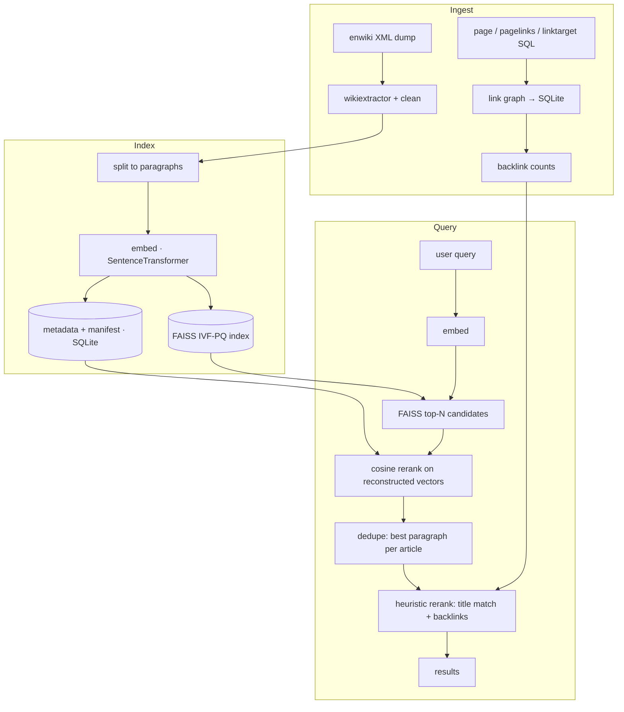

# Semantic Wikipedia Search

Semantic search over the full English Wikipedia — **4.4M articles, 42M paragraph
embeddings** — built end to end: dump parsing, link-graph construction, paragraph
embedding, FAISS indexing, retrieval, reranking, and evaluation.

The interesting part isn't the search engine. It's what happened when I tried to
fine-tune a model to beat the off-the-shelf baseline, measured it honestly, and
found that it didn't.

---

## TL;DR

| | |
|---|---|
| **Corpus** | 4,358,292 articles → 41,953,396 paragraph embeddings (384-dim) |
| **Stack** | SentenceTransformers · FAISS (IVF-PQ) · PySpark · SQLite · Typer · Pydantic |
| **Best result** | Baseline + heuristic rerank — **MRR 0.795, Top-1 0.703** |
| **Fine-tuning outcome** | No improvement over baseline. Diagnosed, measured, documented. |
| **Headline finding** | The training signal was *inverted*: 66% of mined "hard negatives" were more query-relevant than the positives they were paired against. |

---

## Architecture



**Two design decisions worth calling out:**

- **Paragraph-level, not article-level.** Embedding whole articles blurs a
  4,000-word page into one vector. Paragraph granularity keeps retrieval sharp,
  at the cost of needing per-article deduplication at query time.
- **The index and its metadata are written together, with a manifest.** An
  earlier version derived index order from `sorted(glob(...))`, which silently
  drifted out of alignment with the metadata store. Now `embed` records the exact
  write order and `build-index` replays it, asserting
  `index.ntotal == metadata row count` and failing loudly if it ever diverges.

---

## Results

155 hand-labeled queries, each with a set of relevant articles (mean 3.9 per
query). Standard error on MRR at this sample size is roughly **±0.028**, so
differences smaller than ~0.06 are not meaningful.

### Retrieval only (cosine similarity, no rerank)

| Model | MRR | Top-1 | Top-5 | MAP |
|---|---|---|---|---|
| **Baseline** (`all-MiniLM-L6-v2`) | **0.3767** | 0.2194 | **0.5806** | 0.1333 |
| Fine-tuned (8,000 steps) | 0.3754 | 0.2258 | 0.5484 | **0.1493** |

### With heuristic reranking (title match + backlink authority)

| Model | MRR | Top-1 | Top-5 | MAP |
|---|---|---|---|---|
| **Baseline** | **0.7947** | **0.7032** | 0.9032 | 0.3301 |
| Fine-tuned (8,000 steps) | 0.7444 | 0.6065 | **0.9226** | **0.3338** |

**Reranking more than doubles MRR** (0.38 → 0.79). That's the single biggest
lever in the system — larger than any model change measured here.

**Fine-tuning does not beat baseline.** It reaches parity on raw retrieval and
loses on reranked Top-1. A step-count sweep confirmed why:

| Training steps | Retrieval MRR@10 (held-out eval corpus) |
|---|---|
| **0 — untrained baseline** | **0.9753** |
| 400 | 0.9452 |
| 800 | 0.9365 |
| 1,600 | 0.9272 |
| 2,000 | 0.9304 |
| 8,000 | 0.9121 |

Quality declines from the **first** checkpoint. Extrapolated backwards, the
optimum is step zero — the pretrained model. Fine-tuning on this data is
net-negative from the first gradient update.

---

## How I found that out

The negative result only means something because the measurements behind it were
themselves debugged. Four problems, each found by measuring rather than guessing:

### 1. The corpus was 40% structural noise

An audit of 200 raw dump files (~199k articles, ~700k paragraphs) found that
**31% of "paragraphs" were under 40 characters** — bare MediaWiki section
headers surviving as standalone paragraphs. `History.` appeared 8,613 times in
the sample alone; `Career.` 4,347 times. WikiExtractor also emits each article's
title as its own leading paragraph.

Because search deduplicates to the best-scoring paragraph per article, these
stubs *won* — querying "History of the Roman Empire" returned a snippet reading
only `History of the Roman Empire`.

Fixing extraction removed **40.5% of paragraphs while leaving average words per
article unchanged** (630.7 → 630.6), confirming what was cut was structure, not
content.

### 2. The training signal was inverted

Hard-negative mining drew negatives from the anchor's **top-10 nearest
neighbours** — which, in a 42M-paragraph corpus, are by definition the *correct
answers*. The link graph was too weak a filter to tell "hard but unrelated" from
"actually right": one anchor for `Basel SBB railway station` was paired against a
negative that read *"Basel SBB railway station was originally known as the
Centralbahnhof…"*.

Measured over 3,000 triplets:

| | mined negatives | vs. paired positive (0.474) |
|---|---|---|
| Ranks 0–10 (original) | cos **0.556** | **above → inverted** |
| Ranks 1000–2000 (fixed) | cos **0.382** | below → correct |

**66% of training examples taught the model to rank relevant content *below*
less relevant content.** Sampling from a deeper rank band cut that to 38% and
eliminated near-duplicate negatives entirely.

### 3. The evaluation metric was lying

Checkpoints were selected by held-out **triplet accuracy** — scored on triplets
drawn from the same biased distribution as training. A model that learned the
bias thoroughly scored *well* by construction:

```
triplet accuracy:  0.69 → 0.75 → 0.885 → 0.891    (climbing)
true corpus MRR:                          0.16     (collapsed)
```

Replaced with an `InformationRetrievalEvaluator` that ranks the real query set
against a sampled corpus, so selection optimises the actual task. Corpus size was
calibrated deliberately: 50k distractors saturated at MRR 0.9935 (useless for
ranking checkpoints), 2M gave the best separation but cost ~65 min per run, 500k
was the compromise that reliably detects collapse.

### 4. A FAISS correctness bug

While validating the mining fix, batched IVF-PQ searches returned corrupted
results — querying 4 vectors at once returned **one ID repeated, at distance
−0.019, where the true nearest neighbours sit at 0.417**. Single-query searches
were unaffected, which is why the search engine (one query per call) never
exposed it — but mining searches in batches of 128, so every negative it drew was
at risk.

| configuration | result |
|---|---|
| `parallel_mode=0` (default), multi-threaded, batch ≥ 2 | **corrupted** |
| single-threaded, any mode | correct |
| `parallel_mode ∈ {1,2,3}` | correct |

Worked around by setting `parallel_mode=3` on every IVF index load.

---

## Why fine-tuning couldn't win

Beyond the bugs, there's a structural mismatch:

| | task |
|---|---|
| **Evaluation asks** | given a question, find the *set* of topically related articles (mean 3.9) |
| **Training taught** | given a title, find *that same article's* paragraphs |

Training only ever teaches intra-article association. It never says "a Genetics
paragraph answers a DNA query" — before the fix it said the opposite, using such
paragraphs as negatives.

Meanwhile the link graph, used only *defensively* to filter negatives, turns out
to encode almost exactly the relevance the evaluation rewards: **96.5% of
co-relevant articles in the test set are reachable via the primary article's
outbound links.** The signal was there the whole time, on the wrong side of the
objective.

Second factor, stated plainly: `all-MiniLM-L6-v2` is not a general model being
specialised — it is *already* a retrieval model trained on ~1B curated pairs.
Beating it with 34M heuristically-derived triplets from a single corpus was
always a steep ask.

---

## What I'd do next

1. **Expand the evaluation set.** At 155 queries, improvements under ~6% are
   undetectable. This gates everything else.
2. **Use the link graph for positives**, not just negative filtering — directly
   targets the mismatch above, using infrastructure already built.
3. **Train a cross-encoder reranker.** Reranking already carries this system
   (0.38 → 0.79 MRR). Beating a hand-written heuristic is a far easier target
   than beating a strong pretrained bi-encoder, and it cannot degrade retrieval
   because it only reorders.
4. **LLM-generated question anchors** so training inputs match the query
   distribution instead of being bare titles.
5. Iterative hard negatives (ANCE-style) re-mined from the model being trained,
   and cross-encoder distillation into the bi-encoder.

---

## Quickstart

```bash
python -m venv .venv && source .venv/bin/activate
pip install -e .

swsearch search "Who wrote Hamlet?" --k 5
swsearch evaluate --rerank
```

Running the full pipeline from scratch (downloads ~70GB of dumps, produces
~200GB of artifacts, takes the better part of a day on a single GPU):

```bash
swsearch pipeline                  # fetch → linkgraph → extract → embed → index
swsearch pipeline --skip-fetch     # assume data/raw is already populated
```

**GPU note**: `pip install -e .` pulls the CPU-only `torch` build. `swsearch`
auto-detects `torch.cuda.is_available()` and silently falls back to CPU
otherwise. For GPU, reinstall torch from the CUDA wheel index matching your
driver (`cu126` matched an RTX 3070 Ti here):

```bash
pip install --index-url https://download.pytorch.org/whl/cu126 torch
```

Don't add `--no-deps` — torch's CUDA build depends on separate `nvidia-*-cu12`
packages that ship the actual shared libraries.

---

## CLI

```
swsearch pipeline         [--with-triplets] [--skip-fetch] [--index-type flat|ivfpq]
swsearch extract          [--input-dir] [--output-json-dir] [--output-jsonl-dir]
swsearch build-linkgraph  [--page-sql] [--pagelinks-sql] [--linktarget-sql] [--db-out]
swsearch build-backlinks  [--db-in] [--db-out]
swsearch embed            [--input-dir] [--output-dir] [--meta-db] [--model-name] [--batch-size]
swsearch build-index      [--embeddings-dir] [--index-path] [--meta-db] [--index-type]
swsearch mine-triplets    [--jsonl-dir] [--index-path] [--meta-db] [--link-db] [--num-workers]
swsearch train-transfer   [--output-dir] [--learning-rate] [--max-steps] [--eval-meta-db]
swsearch search QUERY     [--k] [--index-path] [--meta-db] [--model-name] [--rerank]
swsearch evaluate         [--test-queries] [--index-path] [--meta-db] [--model-name] [--rerank]
swsearch tools inspect-index INDEX_PATH
```

Every path defaults from `Settings` but is overridable per command, so the whole
pipeline can run against an isolated scratch corpus without touching real data:

```bash
SWSEARCH_PATHS__DATA_ROOT=/tmp/scratch swsearch extract
SWSEARCH_PATHS__DATA_ROOT=/tmp/scratch swsearch embed
```

> **Comparing models**: `swsearch search`/`evaluate` need `--model-name`
> whenever `--index-path` points at a non-default index. The query must be
> encoded by the same model that produced the index, or you are comparing two
> unrelated vector spaces and the scores are meaningless.

> **Default paths are the live index.** `swsearch embed` and `build-index`
> default their *outputs* to `data/processed/models/baseline/runs/all-MiniLM-L6/`,
> and `create_faiss_meta_db()` deletes whatever is already there. Run either
> without explicit path flags and you overwrite the baseline index in place.

---

## Configuration

`pydantic-settings` (`src/swsearch/config.py`), overridable by environment
variable or `.env`, using the `SWSEARCH_` prefix with `__` for nesting:

```bash
SWSEARCH_PATHS__DATA_ROOT=/data/wiki
SWSEARCH_MODEL__EMBEDDING_MODEL_NAME=all-MiniLM-L6-v2
SWSEARCH_MINING__NEGATIVE_RANK_MIN=1000
SWSEARCH_MINING__NEGATIVE_RANK_MAX=2000
SWSEARCH_SPARK__DRIVER_MEMORY=50g
```

All paths resolve absolute (anchored at the repo root), so commands work from
any working directory.

---

## Project structure

```
src/swsearch/
├── config.py                # pydantic-settings singleton
├── cli.py                   # typer app
├── pipeline.py              # chains every stage with timing banners
├── fetch.py                 # idempotent dump download + wikiextractor
├── train.py                 # fine-tuning + retrieval-based checkpoint selection
├── common/                  # shared Spark session, paragraph splitting
├── extract/wikidump.py      # XML → cleaned JSON/JSONL (+ title/header filtering)
├── linkgraph/               # SQL dumps → link graph → backlink counts
├── embed/paragraphs.py      # paragraph embedding + manifest writer
├── metadata/store.py        # FAISS metadata SQLite store
├── index/faiss_store.py     # index build/load, alignment assertions
├── mining/triplets.py       # parallel hard-negative mining (rank-band sampling)
├── search/engine.py         # embed → FAISS → cosine rerank → dedupe
├── rerank/heuristic.py      # title match + backlink authority
└── eval/metrics.py          # MRR, MAP, R-Precision, Top-K

research/custom_encoder.py   # archived: transformer trained from scratch (opt-in TF deps)
gradio/gradio_app.py         # demo UI wired to SearchEngine
scripts/                     # reproducible experiment runners (mining, training probes)
tests/                       # smoke suite + regression tests for past incidents
```

---

## Evaluation methodology

Reported metrics: **MRR**, **MAP**, **Mean R-Precision**, and **Top-K Accuracy**
(K = 1, 3, 5, 10), computed against a real `SearchEngine` — not a stub — over the
full 42M-paragraph index.

Because queries have multiple relevant articles, the metrics split meaningfully:
MRR and Top-1 reward getting the single best article first; MAP and R-Precision
reward surfacing several relevant articles. The fine-tuned model wins on the
latter and loses on the former, which is consistent with what it was trained to
do.

Checkpoint selection during training uses a separate `InformationRetrievalEvaluator`
over a sampled corpus — deliberately *not* the same distribution as the training
triplets, after the original metric proved able to climb while true quality
collapsed.

---

## Notes

Independent project, built solo. Wikipedia dumps are not redistributed here; the
pipeline downloads them directly from `dumps.wikimedia.org`.

The honest summary: the retrieval system works well, reranking carries most of
the quality, and the fine-tuning experiment produced a well-measured negative
result rather than an improvement. Every claim above is reproducible from the
scripts in `scripts/`.
